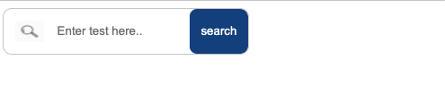

# Basic-Flexbox
In this repo, you will find three different html elements styled with Flexbox. 
* a search bar

* a navigation bar

https://user-images.githubusercontent.com/121530929/233528989-8dc04cc0-fbeb-4ec5-be17-8249f2f5368c.mp4

* a gallery 

https://user-images.githubusercontent.com/121530929/233529007-09e7db08-75b7-463d-bdee-22ac3a0aa4f2.mp4

